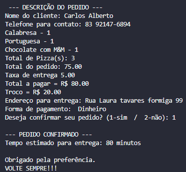

# 🍕 Sistema de Pedidos - Ponto 99

Sistema em Python para simular pedidos de uma pizzaria.

## 🚀 Funcionalidades
- Cadastro de pedidos
- Cálculo automático de valores
- Cálculo de troco

## ▶️ Como executar
```bash
python sistema_pizzaria.py
```

## 📌 Objetivo

Projeto criado para praticar programação e aplicar em um negócio real (minha pizzaria).

## 👨‍💻 Autor

Carlinhos

## 📷 Demonstração


